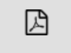
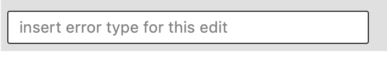
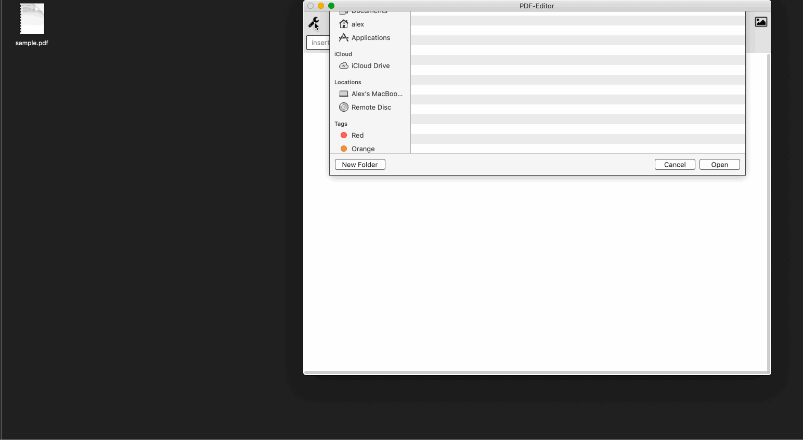
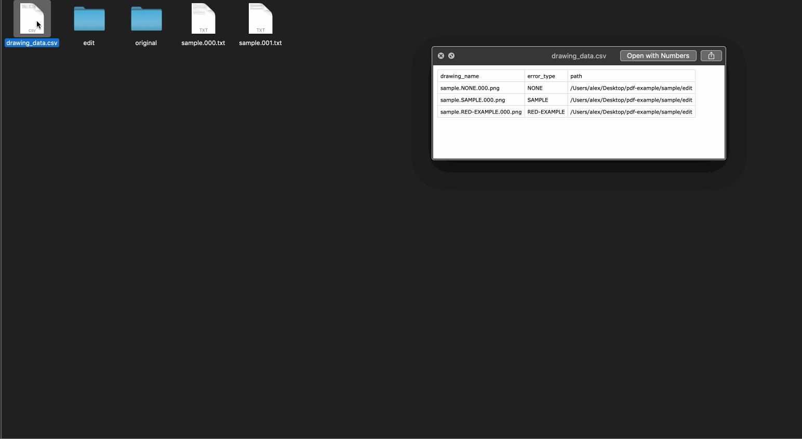

# PDF Editor

This is a small application that I needed to create some data sets to train a neural network to recognise errors in PDFs.

Scenario.

I had a lot of PDFs that were of technical drawings. It was important that the drawings had certain features on them. Currently humans were checking for those features before the PDFs went to clients. This was a boring and monotonous job, however it also required a certain level of skill from the human.

What I did instead was to create this application. The idea of the application is to create training datasets from PDFs. I.e take correct PDFs and using this application, create images from the PDF pages, then remove features and save the images with meaningful names. The application will create the directory structure that [Keras](https://keras.io/) (NN library for python) requires training data to exist in. It will also read out any text of the PDFs it can.

In short this tool allowed me to make my own training datasets based off PDFs so that I could automate the process of looking for errors using [Keras](https://keras.io/) in python (and some hefty GPUs from AWS for the training).

1. Set the working directory (where all the PDFs are stored)
2. Load a PDF. This will cause all pages to be converted to images
3. Select a page/image
4. Decide on a feature you are going to remove. The best approach is to do all the same features for all pdfs/pages at once. Give this error a name. This will form part of the name of the images that are exported. 
	* Note, if you do not give the error a name, it will be saved with NONE as the description. It will then be hard to differentiate the types of errors if you have more than one.
4. Remove a feature from the PDF by using the paint tool.
	* Note, You can change the size of the paint brush
	* When you select the paintbrush the app is in "painting mode". Clicking somewhere on the pdf will begin the painting to remove a feature, clicking again will stop the painting. You can choose from 3 colours.
5. To reset the image hit the eraser. 
6. To save the image hit save
7. Look at the created files in the directory structure.

**Note**, if you know that the feature you want to remove is going to be in the same place on multiple PDF pages, the painting 'effect' will stay there until you hit reset. This means that you can load each of the pages with the same feature, one after another, after you have painted over the feature the first and just hit save on all consecutive pages with that feature. This significantly sped up creating the training sets I needed.

## Demo

A short demo of using the application on a sample pdf document. In the animation below you can see that the app is able to extract text from the PDF. This can be useful if there is text recognition to do on the images/pdfs.

## [Keras](https://keras.io/) CSV

To load the data into [Keras](https://keras.io/) I saved enough information to a csv file so that the path of the training images was easy to access from my python notebook. A short demo showing the output CSV file

## Todo

The paint feature is a little slow, but it solved the problem I had.

## Status

* This works fine on Mac OSX and there is a release available here if you just want to test it out. 
* It has been built successfully for Windows (cross compilation) and has worked there, although I don't have the binary at the moment. Should build fine though.
* The code is not the neatest it could be, I hacked it together off the back of [Got-Qt](https://github.com/amlwwalker/got-qt). For my usecase it did the job

## Cite

* The code uses [go-fitz](https://github.com/gen2brain/go-fitz) to convert the PDF to images.
* The library that constructs the UI is [the Go binding for Qt](https://github.com/therecipe/qt)
* My own "quickstart" qt project template, [Got-Qt](https://github.com/amlwwalker/got-qt)

## Issues

* Let me know if this is useful and I can make changes, or feel free to make pull requests.